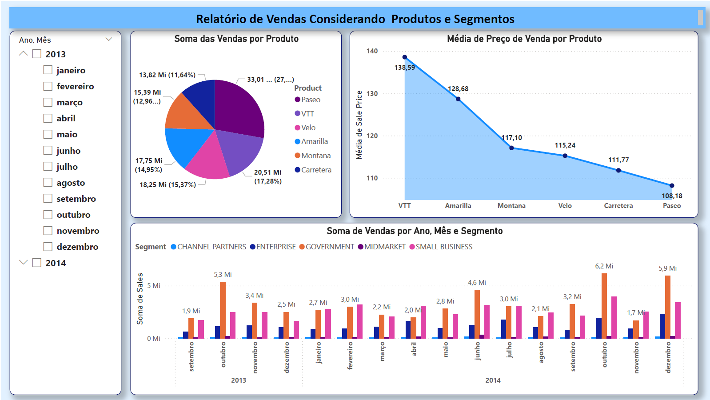

# Dashboard Vendas  :bar_chart:
## NTT DATA - Engenharia de Dados com Python 
  

Descrição.

Desafio de projeto do Módulo de Power BI, realizando a analise dos dados de exemplo do PowerBI.

Dashboard possui três Paginas:
- **Relatório de Vendas Considerando Produtos e Segmentos**

- **Relatório De Vendas Considerando Países e Lucro**

- **Distribuição de Lucro, Vendas e Unidades Vendidas por País e Segmento**
-